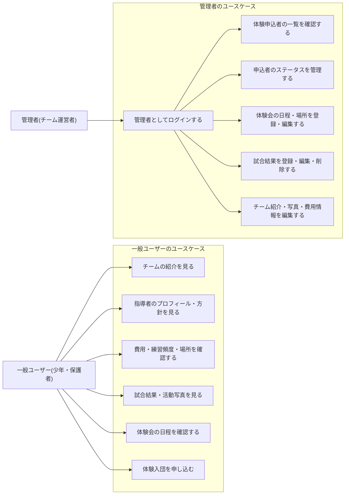
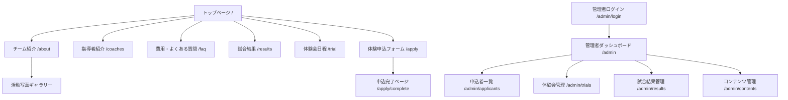
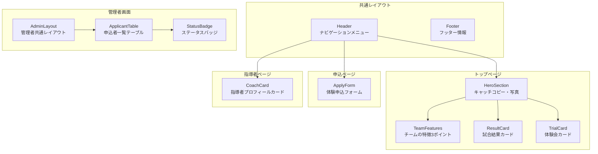
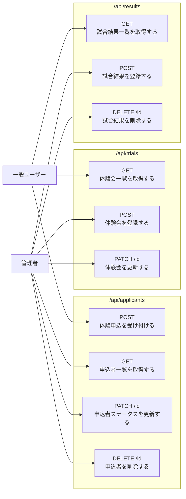
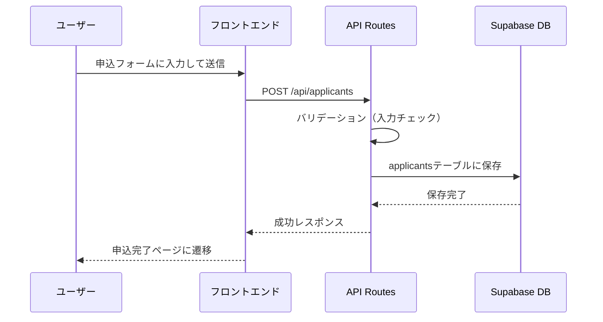
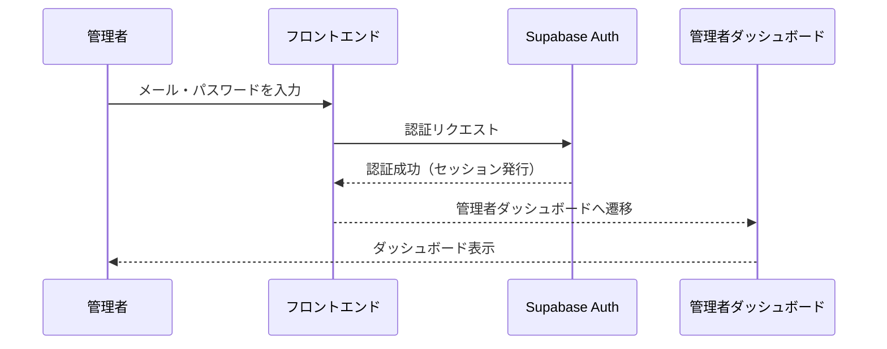
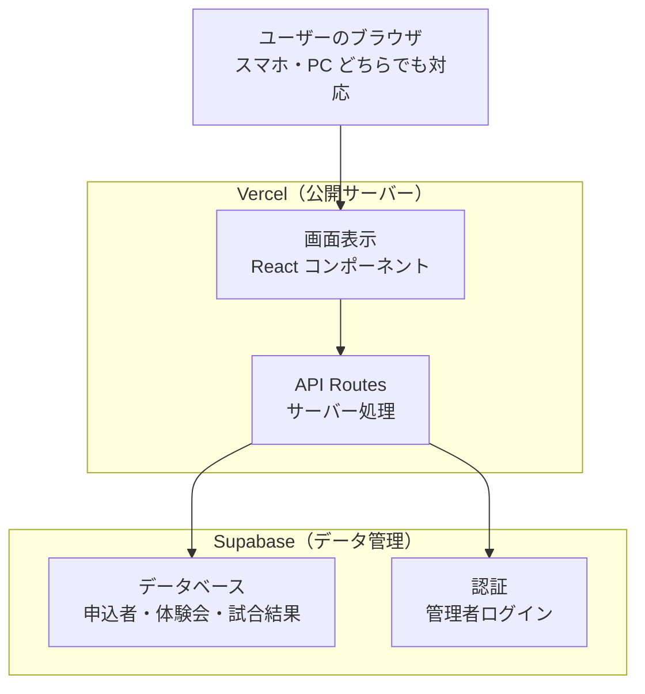

# 機能設計書（Functional Design）

---

## 1. ユースケース図



---

## 2. 画面遷移図



---

## 3. ワイヤーフレーム

### トップページ（/）

┌─────────────────────────────┐
│  ロゴ　　　　　　　　　　　　│
│  [チーム紹介][指導者][費用][試合結果] │
├─────────────────────────────┤
│  キャッチコピー　　　　　　　│
│  「一緒に野球しよう！」　　　│
│  チームの写真（大きく表示）　│
│  [体験入団を申し込む] ボタン　│
├─────────────────────────────┤
│  チームの特徴（3つのポイント）│
│  ① 楽しく　② 安心　③ 実績　│
├─────────────────────────────┤
│  直近の試合結果　　　　　　　│
├─────────────────────────────┤
│  体験会の日程（次回分）　　　│
│  [申し込む] ボタン　　　　　│
└─────────────────────────────┘

### 体験申込フォーム（/apply）

```
┌─────────────────────────────┐
│  体験入団 申し込みフォーム　　│
├─────────────────────────────┤
│  お子さんのお名前 [　　　　]　│
│  お子さんの学年  [　　　　]　│
│  保護者のお名前  [　　　　]　│
│  メールアドレス  [　　　　]　│
│  電話番号　　　　[　　　　]　│
│  希望体験会日程  [選択▼　]　│
│  メッセージ（任意）[　　　]　│
│  　　　　　[申し込む]　　　　│
└─────────────────────────────┘
```

### 管理者：体験会管理（/admin/trials）

```
┌─────────────────────────────┐
│  体験会管理　　　　　　　　　│
├─────────────────────────────┤
│  ＜ 2026年3月 ＞　　　　　　│
│  日  月  火  水  木  金  土  │
│   1   2   3   4   5   6   7 │
│  【21】 22  23  24  25  26  27 │ ← 体験会登録済みは強調表示
│  28  29  30  31　　　　　　 │
│  ※ 祝日は緑字で表示　　　　 │
└─────────────────────────────┘
```

**カレンダー表示ルール：**
- 祝日：**緑字**で表示
- 体験会が登録されている日：強調表示（太字・背景色）
- 過去の日付：グレーアウト

### 管理者：申込者一覧（/admin/applicants）

```
┌─────────────────────────────┐
│  体験申込者一覧　　　　　　　│
├──────┬────┬──────┬──────────┤
│ 名前 │学年│ 申込日 │ ステータス│
├──────┼────┼──────┼──────────┤
│ 山田太郎│3年│3/21│[確認済み▼]│
│ 田中花子│2年│3/20│[未確認▼] │
└──────┴────┴──────┴──────────┘
```

---

## 4. コンポーネント設計



---

## 5. データモデル定義

### applicants テーブル（体験申込者）

| カラム名    | 型        | 説明                       |
| ----------- | --------- | -------------------------- |
| id          | UUID      | 自動生成される識別番号     |
| child_name  | text      | お子さんの名前             |
| child_grade | text      | お子さんの学年             |
| parent_name | text      | 保護者の名前               |
| email       | text      | メールアドレス             |
| phone       | text      | 電話番号                   |
| trial_id    | UUID      | 希望体験会のID             |
| message     | text      | メッセージ（任意）         |
| status      | text      | 未確認・確認済み・参加済み |
| created_at  | timestamp | 申込日時                   |

### trials テーブル（体験会）

| カラム名      | 型        | 説明                   |
| ------------- | --------- | ---------------------- |
| id            | UUID      | 自動生成される識別番号 |
| date          | date      | 体験会の日付           |
| start_time    | time      | 開始時間               |
| location      | text      | 場所                   |
| meeting_point | text      | 集合場所               |
| items_to_bring | text     | 持ち物                 |
| notes         | text      | 備考                   |
| created_at    | timestamp | 登録日時               |

### results テーブル（試合結果）

| カラム名       | 型        | 説明                   |
| -------------- | --------- | ---------------------- |
| id             | UUID      | 自動生成される識別番号 |
| date           | date      | 試合日                 |
| opponent       | text      | 対戦相手               |
| score_our      | integer   | 自チームの得点         |
| score_opponent | integer   | 相手チームの得点       |
| result         | text      | 勝ち・負け・引き分け   |
| tournament     | text      | 大会名（任意）         |
| created_at     | timestamp | 登録日時               |

---

## 6. API設計



---

## 7. 機能ごとのアーキテクチャ

### 体験申込の流れ



### 管理者ログインの流れ



---

## 8. システム構成図


